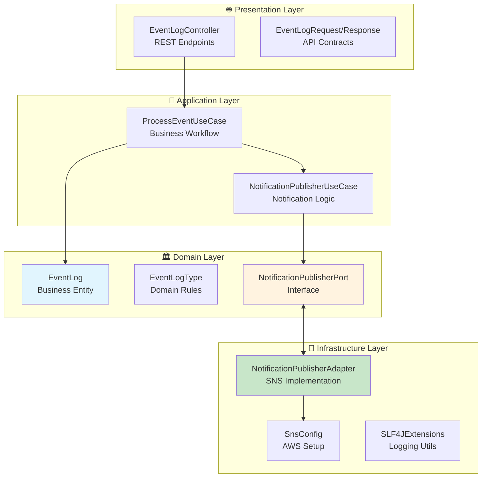
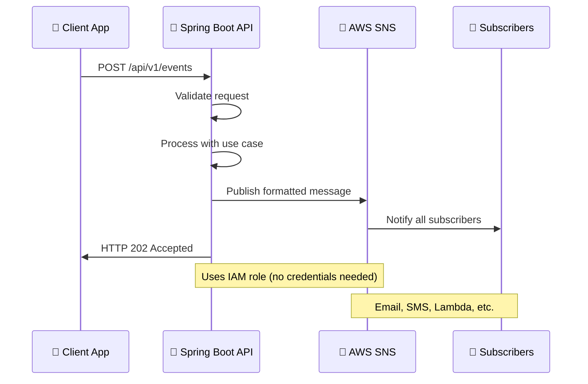

# Home Assistant Log API

A production-ready microservice for Home Assistant event logging with AWS SNS notifications, built with Spring Boot and Kotlin following Clean Architecture principles.

## ⚡ Quick Start - Deploy in 5 Minutes

Get your API running on AWS with one command! Perfect for production or testing.

### 🚀 One-Command AWS Deployment

**Prerequisites:** AWS CLI configured, Terraform installed, SSH key at `~/.ssh/id_rsa`

```bash
# 1. Clone & configure
git clone <repository-url>
cd home-assistant-log-api/terraform
cp terraform.tfvars.example terraform.tfvars

# 2. Edit terraform.tfvars (required fields):
# - my_ip: Get from https://checkip.amazonaws.com  
# - sns_topic_arn: Your existing SNS topic ARN

# 3. Deploy everything automatically
terraform init
terraform apply  # Type 'yes' when prompted
```

**✅ What happens automatically:**
- 🏗️ EC2 instance creation (t3.small, 2GB RAM)
- 🐳 Docker + Docker Compose installation
- 📦 Application build (Gradle + Kotlin)
- 🚀 Service deployment with health checks
- 🔧 Management scripts setup
- ⚡ Ready to use in ~8-10 minutes!

**📱 Access your API:**
```bash
# Health check (from terraform output)
curl http://YOUR-IP:8080/api/v1/events/health

# Send test event
curl -X POST http://YOUR-IP:8080/api/v1/events \
  -H "Content-Type: application/json" \
  -d '{"source": "quick-test", "eventType": "SYSTEM_EVENT", "payload": {"message": "Hello from AWS!"}}'
```

---

## 🏗️ Infrastructure

**For complete deployment guide, cost breakdown, and advanced configurations:** See **[docs/DEPLOYMENT.md](docs/DEPLOYMENT.md)**

### 💰 Quick Cost Overview
- **Total Monthly Cost:** ~$19/month (t3.small + storage)
- **Development:** Use `terraform destroy` when not needed
- **Production:** Includes EC2, EBS, data transfer, SNS

### 🏛️ Architecture Overview
- **EC2 Instance:** t3.small (2GB RAM) - optimized for Gradle builds
- **Security:** IAM roles + Security groups restrict access  
- **Automation:** 223-line `user_data.sh` script for zero-touch deployment
- **Monitoring:** Built-in health checks and management scripts

---

## 🚀 Features

- **⚡ Quick Deploy**: Production-ready in 5 minutes
- **🏗️ Infrastructure as Code**: Terraform automation
- **🔔 Real-time Notifications**: AWS SNS integration
- **🧪 Comprehensive Testing**: 90% test coverage
- **🐳 Containerized**: Docker deployment
- **🔒 Secure**: IAM roles, no hardcoded credentials
- **🎯 Clean Architecture**: Maintainable, testable design
- **📊 Monitoring**: Health checks and logging

---

## 📁 Project Structure

```
home-assistant-log-api/
├── 🏗️ terraform/                    (Infrastructure as Code)
│   ├── main.tf                      (AWS resources definition)
│   ├── user_data.sh                 (Automated setup script - 223 lines)
│   ├── variables.tf                 (Configuration parameters)
│   ├── outputs.tf                   (Connection details)
│   └── terraform.tfvars.example     (Template configuration)
│
├── 📱 logs-api/                     (Main Spring Boot service)
│   ├── [`build.gradle.kts`](logs-api/build.gradle.kts)
│   └── src/main/kotlin/com/homeassistant/
│       ├── domain/                  (Business entities and rules)
│       │   ├── model/EventLog.kt    (Core business entity)
│       │   ├── enum/EventLogType.kt (Event classification)
│       │   └── port/NotificationPublisherPort.kt (Outbound contract)
│       ├── application/             (Business workflows)
│       │   └── usecases/            (ProcessEventUseCase, NotificationPublisherUseCase)
│       ├── infra/                   (External integrations)
│       │   ├── aws/NotificationPublisherAdapter.kt (SNS implementation)
│       │   ├── config/SnsConfig.kt  (AWS configuration)
│       │   └── extensions/SLF4JExtensions.kt (Logging utilities)
│       └── presentation/            (REST API layer)
│           ├── controller/EventLogController.kt (HTTP endpoints)
│           └── dto/EventLogRequest.kt (API contracts)
│
├── 🐳 docker-compose.yml            (Container orchestration)
├── 🐳 Dockerfile                    (Multi-stage container build)
└── 📋 README.md                     (This file)
```

---

## 🔧 EC2 Management

After deployment, manage your instance efficiently:

### 🔑 SSH Access
```bash
# Connect to your instance (IP from terraform output)
ssh -i ~/.ssh/id_rsa ec2-user@<instance-ip>
```

### 🛠️ Management Scripts

The deployment creates a powerful management script:

```bash
# On the EC2 instance
./manage-api.sh status     # ✅ Check application status + health
./manage-api.sh logs       # 📋 View application logs (follow mode)
./manage-api.sh restart    # 🔄 Restart the application
./manage-api.sh update     # 📦 Pull latest code from Git + rebuild
./manage-api.sh test       # 🧪 Test API endpoint + SNS integration
./manage-api.sh stop       # 🛑 Stop the application
./manage-api.sh start      # 🚀 Start the application
```

### 📊 Monitoring & Logs

```bash
# Deployment logs (user_data.sh execution)
tail -f /var/log/user-data.log

# Application container logs
docker-compose logs -f logs-api

# Check deployment completion
cat /home/ec2-user/setup-complete.txt

# Container status
docker-compose ps
```

---

## 🏗️ Architecture

This service follows **Clean Architecture** principles with clear separation between layers:

### 🎯 Architectural Layers



**🔄 Dependency Flow:**
- Dependencies flow **inward** - outer layers depend on inner layers
- **Domain** layer has zero external dependencies
- **Infrastructure** implements domain interfaces
- **Easy to test** and modify without breaking changes

---

## 📡 API Reference

### 🛣️ Endpoints

| Method | Path | Description | Authentication |
|--------|------|-------------|----------------|
| `GET` | `/api/v1/events/health` | ✅ Health check | None |
| `POST` | `/api/v1/events` | 📝 Create event log | None |

### 🏷️ Event Types

| Type | Use Case | Example |
|------|----------|---------|
| **`USER_ACTION`** | Manual user interactions | Light switch, thermostat change |
| **`SYSTEM_EVENT`** | Automated system operations | Backup completion, scheduled task |
| **`ERROR`** | Critical failures | Sensor offline, service crash |
| **`WARNING`** | Non-critical issues | Low battery, connectivity issue |
| **`INFO`** | General information | Status update, routine log |

### 📥 Request Format

```json
{
  "source": "string (required) - Event source identifier",
  "eventType": "enum (required) - USER_ACTION | SYSTEM_EVENT | ERROR | WARNING | INFO", 
  "timestamp": "string (optional) - ISO8601 format, defaults to now",
  "payload": "object (optional) - Additional event data"
}
```

### 📤 Response Format

```json
// Success (HTTP 202 Accepted)
{
  "message": "Event processed successfully",
  "timestamp": "2024-01-15T10:30:00Z"
}

// Error (HTTP 400 Bad Request)
{
  "timestamp": "2024-01-15T10:30:00Z",
  "status": 400,
  "error": "Bad Request",
  "message": "Validation failed: source is required",
  "path": "/api/v1/events"
}
```

### 🧪 API Examples

<details>
<summary>📱 User Action Example</summary>

```bash
curl -X POST http://localhost:8080/api/v1/events \
  -H "Content-Type: application/json" \
  -d '{
    "source": "home-assistant-frontend",
    "eventType": "USER_ACTION",
    "payload": {
      "action": "light_turned_on",
      "device_id": "living_room_light",
      "user": "john",
      "brightness": 85
    }
  }'
```

**📨 SNS Notification:**
```
🏠 New Home Assistant Event
Source: home-assistant-frontend
Type: USER_ACTION
Timestamp: 2024-01-15T10:30:00Z
Payload: {"action":"light_turned_on","device_id":"living_room_light","user":"john","brightness":85}
```

</details>

<details>
<summary>⚙️ System Event Example</summary>

```bash
curl -X POST http://localhost:8080/api/v1/events \
  -H "Content-Type: application/json" \
  -d '{
    "source": "home-assistant-automation",
    "eventType": "SYSTEM_EVENT", 
    "payload": {
      "event": "backup_completed",
      "size": "150MB",
      "duration": "2m30s",
      "success": true
    }
  }'
```

</details>

<details>
<summary>🚨 Error Event Example</summary>

```bash
curl -X POST http://localhost:8080/api/v1/events \
  -H "Content-Type: application/json" \
  -d '{
    "source": "sensor_network",
    "eventType": "ERROR",
    "payload": {
      "error": "sensor_offline", 
      "sensor_id": "temp_sensor_01",
      "last_seen": "2024-01-15T09:45:00Z",
      "location": "living_room"
    }
  }'
```

</details>

---

## 🔔 AWS SNS Integration

### 📬 Notification Flow



### 📝 Message Format

SNS notifications follow this structure:

```
🏠 New Home Assistant Event
Source: {source}
Type: {eventType}
Timestamp: {timestamp}
Payload: {formatted-json}
```

### ⚙️ AWS Setup Requirements

1. **SNS Topic**: Create or use existing topic
2. **IAM Role**: EC2 instance needs `sns:Publish` permission (handled by Terraform)
3. **Subscribers**: Configure email/SMS/Lambda endpoints

---

## 🧪 Testing

### 🏃‍♂️ Running Tests Locally

```bash
# Run all tests with coverage
./gradlew test jacocoTestReport

# Run specific test categories
./gradlew test --tests="*UnitTest*"        # Unit tests only
./gradlew test --tests="*IntegrationTest*" # Integration tests only
./gradlew test --tests="*SNS*"            # SNS-related tests

# Continuous testing (watch mode)
./gradlew test --continuous
```

### 📊 Test Coverage Report

```bash
# Generate and view coverage report
./gradlew jacocoTestReport
open logs-api/build/reports/jacoco/test/html/index.html
```

### 🧪 Test Categories

| Category | Coverage | Description |
|----------|----------|-------------|
| **Unit Tests** | ~95% | Business logic, use cases, entities |
| **Integration Tests** | ~85% | API endpoints, Spring context |
| **AWS Mock Tests** | ~90% | SNS integration with localstack |
| **Contract Tests** | ~100% | API request/response validation |

### 🔬 Test Examples

**Test Structure:**
- **Unit Tests**: Business logic in [`src/test/kotlin/.../usecases/`](logs-api/src/test/kotlin/com/homeassistant/application/usecases/)
- **Integration Tests**: API endpoints in [`src/test/kotlin/.../controller/`](logs-api/src/test/kotlin/com/homeassistant/presentation/controller/)
- **AWS Mock Tests**: SNS integration in [`src/test/kotlin/.../aws/`](logs-api/src/test/kotlin/com/homeassistant/infra/aws/)

All tests follow Given-When-Then pattern with comprehensive mocking and assertions.

---

## 🛠️ Development

### 🔧 Local Development Setup

```bash
# 1. Clone repository
git clone <repository-url>
cd home-assistant-log-api

# 2. Set environment variables
export AWS_REGION=us-east-1
export AWS_SNS_TOPIC_ARN=arn:aws:sns:us-east-1:123456789012:test-topic
# For local development, you can use LocalStack or mock credentials

# 3. Verify code quality
./gradlew ktlintCheck

# 4. Run tests
./gradlew test

# 5. Start development server
./gradlew :logs-api:bootRun
```

### 🎨 Code Quality & Style

This project uses **[ktlint](https://pinterest.github.io/ktlint/)** for consistent code formatting:

```bash
# Check code style (CI/CD requirement)
./gradlew ktlintCheck

# Auto-fix formatting issues  
./gradlew ktlintFormat

# Pre-commit hook setup
./gradlew addKtlintCheckGitPreCommitHook
```

**📏 Style Rules:**
- ✅ Official Kotlin conventions
- ✅ 4-space indentation
- ✅ 120-character line limit
- ✅ Import organization
- ✅ Trailing space removal

### 🔄 Adding New Features

Follow this workflow for new features:

1. **🏛️ Domain First**: Add entities and business rules
2. **💼 Use Cases**: Implement business workflows
3. **🔌 Infrastructure**: Add external integrations
4. **🌐 Presentation**: Expose via REST API
5. **🧪 Tests**: Comprehensive testing for all layers

### ⚙️ Configuration Management

| Environment | Profile | Configuration |
|-------------|---------|---------------|
| **Development** | `dev` | [`application.yml`](logs-api/src/main/resources/application.yml) + local env vars |
| **Testing** | `test` | [`application-test.yml`](logs-api/src/main/resources/application-test.yml) + mocked services |
| **Production** | `prod` | [`application-prod.yml`](logs-api/src/main/resources/application-prod.yml) + IAM roles |

---

## 🐳 Docker & Containerization

### 🏗️ Multi-Stage Dockerfile

Our optimized [`Dockerfile`](Dockerfile) uses multi-stage builds for efficiency:

**Build Stage:**
- Uses full JDK for Gradle compilation
- Copies source code and builds Spring Boot JAR

**Runtime Stage:**
- Uses lightweight JRE (smaller image)
- Includes curl for health checks
- Optimized JVM settings for containers

### 🐳 Docker Compose

The [`docker-compose.yml`](docker-compose.yml) file defines:

**Service Configuration:**
- **Port mapping**: 8080 (host) → 8080 (container)
- **Environment**: Loads from `.env` file (see [`.envrc`](.envrc) for local development)
- **Restart policy**: Unless manually stopped
- **Health checks**: Automatic API endpoint monitoring

### 🚀 Container Commands

```bash
# Local development
docker-compose up -d

# View logs
docker-compose logs -f logs-api

# Rebuild on changes
docker-compose up -d --build

# Check health
docker-compose ps
```

---

## 📚 Documentation

### **📋 Quick Reference:**
- **🚀 Deployment**: See **[docs/DEPLOYMENT.md](docs/DEPLOYMENT.md)** for complete infrastructure setup
- **🐛 Troubleshooting**: See **[docs/TROUBLESHOOTING.md](docs/TROUBLESHOOTING.md)** for common issues and solutions

### **🔧 Quick Fixes:**
- **OutOfMemoryError**: Use `instance_type = "t3.small"` in [`terraform.tfvars`](terraform/terraform.tfvars)
- **docker-compose not found**: Fixed in latest [`user_data.sh`](terraform/user_data.sh)
- **Health check fails**: Wait 60-90s for Spring Boot startup

**Need help?** Check logs at `/var/log/user-data.log` and create a GitHub issue with debug information.

---

## 🚀 Production Deployment

### ✅ Production Checklist

- [ ] **🔒 Security:** Configure HTTPS/SSL certificates
- [ ] **🔐 Secrets:** Use AWS Secrets Manager for sensitive data
- [ ] **🏷️ Monitoring:** Set up CloudWatch alarms and dashboards  
- [ ] **📊 Logging:** Configure centralized log aggregation
- [ ] **🔄 Backup:** Implement automated backup strategy
- [ ] **📈 Scaling:** Configure auto-scaling groups
- [ ] **🌐 DNS:** Set up custom domain with Route 53
- [ ] **🛡️ Security:** Enable AWS GuardDuty and Security Hub

### 🏗️ Infrastructure Evolution

| Stage | Infrastructure | Complexity | Cost |
|-------|---------------|------------|------|
| **🚀 MVP** | Single EC2 + user_data.sh | Low | ~$19/month |
| **📈 Growth** | ALB + Auto Scaling + RDS | Medium | ~$100/month |
| **🏢 Enterprise** | EKS + Fargate + Aurora | High | ~$500/month |

### 🔄 CI/CD Pipeline

For automated deployments, create a GitHub Actions workflow file at `.github/workflows/deploy.yml`. 

**Key components:**
- **Trigger**: Push to main branch
- **Actions**: Checkout code, setup Terraform, apply infrastructure
- **Security**: Use GitHub Secrets for AWS credentials

See the [GitHub Actions documentation](https://docs.github.com/en/actions) for detailed workflow examples.

---

## 📚 Additional Resources

### 📖 Documentation
- [🍃 Spring Boot Documentation](https://spring.io/projects/spring-boot)
- [🔷 Kotlin Documentation](https://kotlinlang.org/docs/)
- [📮 AWS SNS Documentation](https://docs.aws.amazon.com/sns/)
- [🏗️ Terraform AWS Provider](https://registry.terraform.io/providers/hashicorp/aws/latest/docs)

### 🎓 Learning Resources
- [🏛️ Clean Architecture Guide](https://blog.cleancoder.com/uncle-bob/2012/08/13/the-clean-architecture.html)
- [🎨 Kotlin Style Guide](https://kotlinlang.org/docs/coding-conventions.html)
- [🐳 Docker Best Practices](https://docs.docker.com/develop/best-practices/)
- [☁️ AWS Well-Architected Framework](https://aws.amazon.com/architecture/well-architected/)

### 🛠️ Tools & Integrations
- [🔍 ktlint - Kotlin Linter](https://pinterest.github.io/ktlint/)
- [🧪 Testcontainers](https://www.testcontainers.org/) for integration testing
- [📊 Micrometer](https://micrometer.io/) for metrics
- [🔍 AWS X-Ray](https://aws.amazon.com/xray/) for distributed tracing

---

## 📄 License

MIT License - see [LICENSE](LICENSE) file for details.

---

<div align="center">

**🏠 Built for Home Assistant • ☁️ Deployed on AWS • 🚀 Ready for Production**

Made with ❤️ using Spring Boot, Kotlin, and Terraform

</div> 